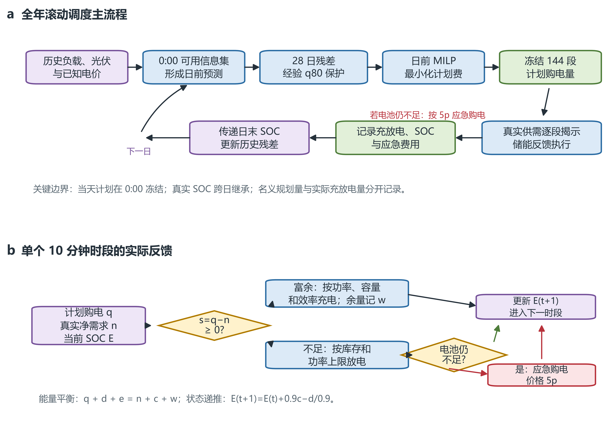
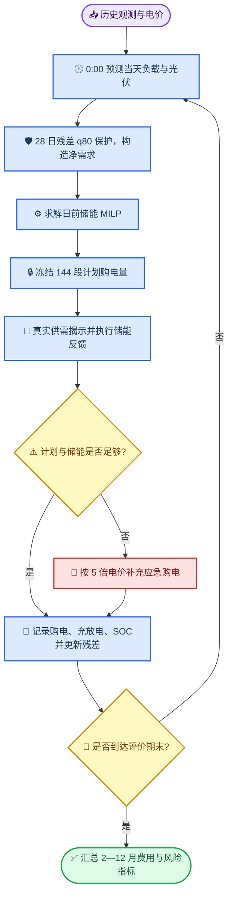

# 问题二解题思路与流程图

*本文档概括问题二冻结方案的建模逻辑，可直接作为论文“问题分析—模型建立—算法流程”部分的绘图底稿。*

---

## 📋 核心思路

问题二的本质是一个带预测误差和储能跨时段耦合的滚动调度问题。每天 0:00 只能利用此前已经结束并可用的负载、光伏观测，先预测当天 144 个 10 分钟时段的功率，再将预测功率转化为净需求，最后求出当天冻结的计划购电量。

冻结方案采用以下闭环：

1. 以历史信息训练/更新负载和光伏预测器，得到 $hat L_{k,t}$、$hat V_{k,t}$。
2. 计算最近 28 日、同一目标时段的预测残差，并取经验 80% 分位数 $r_{k,t}$，形成保护需求
   $	ilde n_{k,t}=(hat L_{k,t}-hat V_{k,t})/6+r_{k,t}$。
3. 在当天实际初始储电量已知的条件下，用 MILP 最小化全天计划购电费，输出 144 段计划购电量 $q_{k,t}$。
4. 当真实负载和光伏逐段揭示后，不照搬 MILP 的名义充放电轨迹，而是按实际净需求执行储能反馈。
5. 若计划购电和电池均不足以满足负载，则补充应急购电；应急电价为交易时刻电价的 5 倍。
6. 将真实日末储电量和已实现残差传递给下一天，连续滚动至 2025-12-31。

每个 10 分钟段 $Delta t=1/6$ 小时，实际净需求为

$$
n_{k,t}=(L_{k,t}-V_{k,t})\Delta t.
$$

实际能量平衡为

$$
q_{k,t}+d_{k,t}+e_{k,t}=n_{k,t}+c_{k,t}+w_{k,t},
$$

其中 $q$ 为计划购电，$c,d$ 为母线侧充、放电量，$e$ 为应急购电量，$w$ 为未使用的计划购电量。

## 🎯 总体解题流程

下图是问题二从数据进入到全年评价的主流程。菱形节点表示必须满足的决策条件，虚线回路表示跨日状态和残差更新。



*图：问题二的双层解题流程。a，0:00 日前预测、风险保护、计划优化和跨日滚动；b，真实供需揭示后单个 10 分钟时段的储能反馈及应急购电判定。*



## 🔋 单时段实际反馈流程

日前 MILP 只生成计划购电量和名义可行轨迹；真实执行必须使用当天实际的 $n_t$ 和当前电池状态 $E_t$。令

$$
s_t=q_t-n_t.
$$

- 当 $s_t\ge 0$ 时，先按功率上限、剩余容量和充电效率确定充电量；无法吸收的部分记为 $w_t$。
- 当 $s_t<0$ 时，先按功率上限和可用库存放电；电池仍不能覆盖的缺口记为 $e_t$，并按 $5p_t$ 计费。
- 状态递推为
  $\displaystyle E_{t+1}=E_t+\eta_c c_t-d_t/\eta_d$，其中 $\eta_c=\eta_d=0.9$。

```mermaid
flowchart LR
    accTitle: 单时段储能反馈
    accDescr: 依据计划购电与实际净需求的差值，分别处理光伏富余、储能放电和应急购电，同时更新电池储电量。

    interval[🔎 当前 10 分钟段] --> surplus{📊 s=q-n 的符号?}
    surplus -->|s ≥ 0，供电富余| charge[🔋 受容量与功率约束充电]
    charge --> unused[📦 剩余部分记为未使用购电 w]
    surplus -->|s < 0，供电不足| battery{🔋 电池可覆盖缺口?}
    battery -->|是| discharge[🔋 按库存与功率上限放电]
    battery -->|否| emergency[🚨 剩余缺口按 5p 应急购电]
    discharge --> state[🧮 更新 E(t+1)]
    emergency --> state
    unused --> state
    state --> next_interval([➡️ 进入下一时段])

    classDef process_style fill:#dbeafe,stroke:#2563eb,stroke-width:2px,color:#1e3a5f
    classDef decision_style fill:#fef9c3,stroke:#ca8a04,stroke-width:2px,color:#713f12
    classDef danger_style fill:#fee2e2,stroke:#dc2626,stroke-width:2px,color:#7f1d1d
    classDef success_style fill:#dcfce7,stroke:#16a34a,stroke-width:2px,color:#14532d

    class interval,charge,unused,discharge,state process_style
    class surplus,battery decision_style
    class emergency danger_style
    class next_interval success_style
```

## ⚙️ 日前 MILP 的输入、目标与约束

### 输入

| 输入 | 含义 |
|---|---|
| $p_t$ | 附件 1 的已知分时电价 |
| $\hat L_t,\hat V_t$ | 0:00 基于历史信息形成的负载、光伏预测 |
| $r_t$ | 最近 28 日同目标时段预测残差的经验 80% 分位数 |
| $E_0$ | 当天实际初始储电量，跨日继承 |
| $\Delta t$ | 10 分钟，即 $1/6$ 小时 |

### 目标函数

日前内层问题最小化计划购电费：

$$
\min \sum_{t=0}^{143}p_tq_t.
$$

这里的 MILP 并不直接最小化随机执行后的期望应急费用；风险通过 q80 保护净需求间接进入，实际总费用必须在真实反馈执行后另行核算。

### 主要约束

$$
\begin{aligned}
&\tilde n_t=\frac{\hat L_t-\hat V_t}{6}+r_t,\\
&q_t+\bar d_t=\tilde n_t+\bar c_t+\bar w_t,\\
&\bar E_{t+1}=\bar E_t+0.9\bar c_t-\bar d_t/0.9,\\
&1200\le \bar E_t\le10800,\\
&0\le \bar c_t,\bar d_t\le M,\qquad M=5000/6\ \mathrm{kWh},\\
&\bar c_t\text{ 与 }\bar d_t\text{ 由二进制变量控制，不允许同段同时充放电}.
\end{aligned}
$$

最终冻结方案采用**自由名义末态**：自然日 24:00 的名义储电量只受 $1200\le E\le10800$ 约束，不额外强制每日回到 6000 kWh。固定 6000 kWh 方案作为终端约束对照，不是题面硬性条件。

## 📊 输出与评价

全年滚动运行后，对 2025-02-01—2025-12-31 的 334 天进行汇总：

- 计划购电量与计划购电费；
- 应急购电量与 $5p_t$ 应急费用；
- 充电量、放电量、未使用购电量和效率损耗；
- 每日应急事件数、应急天数、月度费用；
- 日初、日末和跨日继承的实际 SOC。

论文中应特别区分：

1. **名义规划量**（MILP 为保证计划可行性产生）与**实际执行量**（由真实供需和反馈控制决定）；
2. **自然日账本**与**模板日账本**，两者因首尾 10 分钟区间不同不能混加；
3. 题面强制的计划购电表、充放电表、应急购电表与模型诊断指标。

## 🧭 实现对应文件

- [问题二建模报告](../问题二建模报告.md)：符号、模型、约束和限制的完整说明
- [统一新时间映射实验结果报告](../问题二_统一新时间映射实验结果报告.md)：冻结参数、验证结果和费用汇总
- [正式结果文件](../../附件/附件5/result2.xlsx)：题面要求的最终填表结果
- `results/q2_time_mapping/N_free/natural_dispatch.csv`：最终方案实际逐段轨迹
- `results/q2_time_mapping/N_free/template_plan.csv`：最终方案逐日冻结的计划购电量

---

## 🔗 参考

流程图按 Mermaid Markdown 形式保存，便于 GitHub、VS Code 和常见论文协作工具直接渲染；后续如需位图或矢量图，可由该 Mermaid 源文件统一导出。
