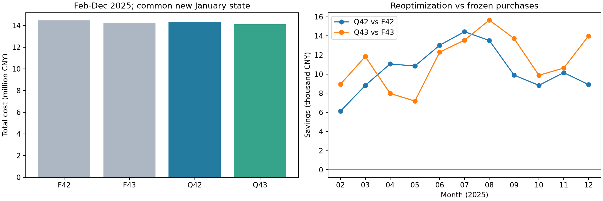

# 问题四已知波动电价首轮实验结果

状态更新（2026-09-13）：本报告为主 Agent 此前提前运行的q80草稿，尚未接收为正式问题四结论。用户已明确主 Agent 只制定实验方案，由实验 Agent 执行；当前任务见[已知电价迁移实验方案](问题四_已知电价迁移实验方案_实验Agent任务书.md)。下文保留原计算与有限自检记录供追溯，不代表Linear＋q75迁移已完成，正式Excel未填写。

## 1. 问题分析

每天0:00已知当天00:10至次日00:10的144段附件4交付电价，包含次日午夜尾段；这是用户选定的信息假设。未来负载、光伏实测和未发布预报仍不可用于计划。4-2每日一次普通计划，4-3在6/12/18点按最新光伏预报修订未来计划。

本轮按本任务此前固定的q80首轮规格运行。问题三其他任务已推进到Linear+q75首选候选；本次Q43明确对应其保留的Linear+q80/B2基准，不冒称已经迁移q75，也不据本次结果替换问题三候选。

## 2. 数据预处理与公共初始化

附件2/4均按365×144读取，日期及时间列逐项核对。自然午夜价格来自前一源行末列，其余来自本行前143列；没有循环错用本日尾价。00:10代表00:10—00:20。

公共一月从6000 kWh出发：1月1日普通计划0、电池静置；缺失的00:00—00:10供需/费用保留未知。1月2日仍为零普通计划、恢复实际反馈。1月3—31日复用已保存朴素预测，不加q80，采用名义自然24:00为6000的MILP，仅将电价替换为附件4，并连续执行实际反馈。共29次求解。

重算后2月1日00:00库存 **6097.354410000 kWh**，午夜承诺 **0.000000000 kWh**。两分支与对照均从此处出发。一月不进入正式2—12月现金费用；6000名义末态只用于公共一月，正式期采用自由末态。

供需预测/保护直接读冻结档案，不重训：Q42来自问题二15/12特征LightGBM与W28/q80；Q43来自问题三15特征负载、Linear光伏转换和同发布组W28/q80。价格改变不改变这些外生预测误差档案。档案来源与哈希见registration.json。

## 3. 模型建立

保持单向效率0.9、1200—10800 kWh库存界及5000 kW充放电功率上限。计划通过MILP求解，实际富余优先充电、缺口优先放电、剩余应急，状态跨日连续。

Q42的名义目标为$\sum_t p_tq_t^0$；Q43日内目标为$\sum_t p_t(q_t+0.5|q_t-q_t^0|)$。新旧方案在同一保护需求、价格和真实库存下，以普通费、调整费及反馈预测应急费合计评分，严格降低超过0.0001元才替换。实际费用分别为$\sum p_t(q_t^0+5e_t)$和$\sum p_t(q_t^{eff}+0.5|q_t^{eff}-q_t^0|+5e_t)$；每段相对原始承诺最终一次结算。

F42/F43固定前问保存的原始/有效普通购电计划，从新的公共初态重放同一实际反馈，价格改用附件4，首个午夜承诺替换为公共新承诺。它们是固定计划的可执行回放基准，不是从新初态重新运行固定价优化器的反事实；F43也不重新进行新旧评分。与原动作原封不动重计费相比，此设计匹配了本次初态，因此其应急和库存可因初态变化而略有变化。

## 4. 模型求解与结果

以下统一为自然日账本A：2025-02-01至12-31，334天、48096段，单位元。

| 组别 | 总费用 | 普通费 | 调整费 | 应急费 | 应急电量/kWh |
| --- | --- | --- | --- | --- | --- |
| F42 | 14,463,503.57 | 13,998,469.03 | 0.00 | 465,034.55 | 73,095.96 |
| F43 | 14,254,151.16 | 13,648,867.87 | 457,958.79 | 147,324.51 | 25,269.23 |
| Q42 | 14,347,907.89 | 13,872,116.16 | 0.00 | 475,791.73 | 74,524.09 |
| Q43 | 14,128,508.35 | 13,525,776.92 | 456,287.58 | 146,443.85 | 25,769.11 |

| 比较 | 节省金额/元 | 节省比例 | 更省月份 | 更省天数 |
| --- | --- | --- | --- | --- |
| Q42 对 F42 | 115,595.68 | 0.7992% | 11/11 | 286/334 |
| Q43 对 F43 | 125,642.81 | 0.8814% | 11/11 | 296/334 |
| Q43 对 Q42 | 219,399.54 | 1.5291% | 10/11 | 165/334 |

Q43与Q42的差同时包含光伏预测源和日内调整机制变化，不能解释为纯预报信息价值或纯调整收益。相对各自固定计划基准的差反映该具体重优化策略的收益，不证明全局随机最优。

风险没有全面改善：Q42相对F42应急费增加10,757.19元，应急天数由119增至132；其节费来自普通购电费下降。Q43相对F43应急电量增加499.88 kWh，但应急费减少880.66元，应急天数由108增至114。费用、电量与事件数不能互相替代。

Q43日内接受情况：6:00接受334/334次; 12:00接受334/334次; 18:00接受200/334次。

| 组别 | 自然账本A总费/元 | 模板账本B总费/元 | 自然期末库存/kWh | 模板期末库存/kWh |
| --- | --- | --- | --- | --- |
| F42 | 14,463,503.572952 | 14,463,791.409334 | 1,682.897933 | 1,642.185864 |
| F43 | 14,254,151.163655 | 14,254,439.000036 | 1,682.897933 | 1,642.185864 |
| Q42 | 14,347,907.892045 | 14,347,907.892045 | 2,335.428116 | 1,602.468857 |
| Q43 | 14,128,508.351016 | 14,128,508.351016 | 2,335.428116 | 1,602.468857 |

账本B覆盖各模板的00:10起144段；其总费与A之差等于2026-01-01午夜尾段费用减2025-02-01午夜首段费用。所有表格和差额比较必须使用同一账本。

### 指定日期自然日结果

| 组别 | 日期 | 总费/元 | 原计划量/kWh | 有效普通购电/kWh | 应急/kWh | 日初库存/kWh | 日末库存/kWh |
| --- | --- | --- | --- | --- | --- | --- | --- |
| Q42 | 2025-03-20 | 42,771.26 | 68,624.223 | 68,624.223 | 0.000 | 2,861.632 | 1,621.620 |
| Q42 | 2025-06-21 | 18,007.63 | 36,464.731 | 36,464.731 | 0.000 | 2,635.444 | 3,632.266 |
| Q42 | 2025-09-23 | 47,038.07 | 68,821.641 | 68,821.641 | 435.513 | 1,424.697 | 1,566.484 |
| Q42 | 2025-12-21 | 73,749.00 | 97,024.507 | 97,024.507 | 0.000 | 2,572.746 | 1,803.386 |
| Q43 | 2025-03-20 | 43,261.34 | 70,936.014 | 66,311.867 | 27.715 | 2,852.911 | 1,781.961 |
| Q43 | 2025-06-21 | 17,970.56 | 36,303.000 | 36,232.072 | 0.000 | 2,659.679 | 3,698.840 |
| Q43 | 2025-09-23 | 45,878.61 | 73,798.340 | 68,210.318 | 10.285 | 1,618.619 | 1,648.240 |
| Q43 | 2025-12-21 | 73,809.81 | 97,474.668 | 95,384.286 | 12.918 | 2,583.606 | 1,803.386 |

此表购电量按自然日汇总，含前日继承午夜承诺；不是当天0:00发布的模板144段总量。逐段数据含日期、原始/有效计划、供需、储能和费用。指定日六个4小时充放电及连续应急事件见结果目录。

### 验证与边界

输入日期/时间列、全期价格逐段映射、公共初态、实际能量平衡/状态递推/上下界/功率/互斥、现金结算及双账本桥接均通过。Q42/Q43保存的名义充放电及状态也重新读回核对能量等式。6月21日使用问题二既有独立组装内核按同一新价格及真实初态求解一次，目标差3.48e-13元；允许等费用多解，不声称计划唯一。

新增主求解1699次（公共一月29＋Q42 334＋Q43 1336），额外单日核对1次，训练0次，整轮54.54秒。本轮复用上游供需预测/保护信息边界证据，没有重建训练链或新增全期泄漏扰动测试；已知价格不适用“未来价格扰动后计划不变”检验。未运行DP、联合情景、分位扫描或额外终端实验。

本年数据已用于此前模型设计，结果是因果历史回测，不是独立盲测。自由末态和贪心反馈仍有短视风险，期末库存应与现金费一起阅读。固定计划对照不会证明附加信息的理论最优价值。

### 复现与文件

- 计算：`conda run -n math_modeling python code/q4_known_price_experiment.py`。
- 只读报告：`conda run -n math_modeling python code/q4_known_price_report.py`。
- 数值证据：`results/q4_known_price/`，包含注册哈希、公共一月、各组dispatch、Q42/Q43计划版本及名义完整电量/状态、求解日志、月度/日度、指定日期及检查。
- 本轮保留四组CSV实验结果，不覆盖附件5的正式result4-2.xlsx和result4-3.xlsx。
